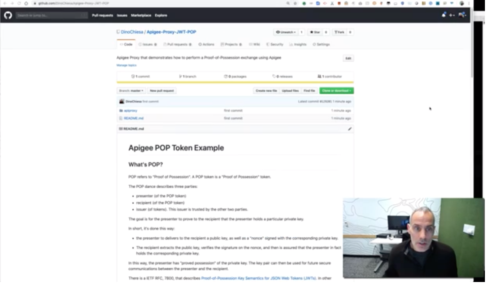

# Apigee POP Token Example

## What's POP?

POP refers to "Proof of Possession". A POP token is a "Proof of Possession"
token.

The POP dance describes three parties:
- presenter (of the POP token)
- recipient (of the POP token)
- issuer (of tokens). This issuer is trusted by the other two parties.

The goal is for the presenter to prove to the recipient that the presenter holds
a particular private key.

In short, it's done this way:

- the presenter to delivers to the recipient a public key, as well as a "nonce"
  signed with the corresponding private key.

- The recipient extracts the public key, uses that to verify the signature on the nonce, and
  then is assured that the presenter in fact holds the corresponding private
  key.

In this way, the presenter has "proved possession" of the private key.
The key pair can then be used for future secure communications between the
presenter and the recipient.

[IETF RFC 7800](https://tools.ietf.org/html/rfc7800) describes [Proof-of-Possession Key
Semantics for JSON Web Tokens (JWTs)](https://tools.ietf.org/html/rfc7800).
In other words, how JWT can be used to implement a POP exchange among the three parties.


## POP in Apigee

Apigee can support a POP exchange according to the description in
RFC 7800. Apigee has built-in policies that can be used to generate or verify
signed JWT, and based on that capability, can act as any of the three parties in
the exchange: Presenter, Issuer, or Recipient.

## This Example

In this example, Apigee acts as both the issuer and the
recipient. I've used two distinct proxy endpoints to separate those
concerns. (There's no need for Apigee to be both, and usually the Issuer and
Recipient will be different actors.)

Apigee could also act as the Presenter in a POP exchange. This example does not show that.

## Screencast

You can view a [screencast of this
example](https://youtu.be/XtlHv_-l9qg) on Youtube:
[](https://youtu.be/XtlHv_-l9qg)


## To use it

To try this example yourself, first deploy the proxy to any Apigee ORG + ENV.
To do so you can use a command-line tool like [importAndDeploy](https://github.com/DinoChiesa/apigee-edge-js/blob/master/examples/importAndDeploy.js) or just
manually zip up the apiproxy directory and use the Apigee UI to import the zip.

Then, follow these steps:

1. Presenter invokes the issuer, to request a pop token:

   ```
   ORG=myorg
   env=myenv
   curl -i -X POST -H content-type:application/json \
       https://$ORG-$ENV.apigee.net/jwt-pop/issuer/poptoken?sub=subject \
       -d '{ "jku": "url-pointing-to-JWKS", "kid": "key-id"}'
   ```

   For demonstration purposes, we can use [a demonstration
   JWKS endpoint](https://jwks-service.appspot.com) that publishes its private keys. First,
   get the list of RSA keys:

   ```
   curl https://jwks-service.appspot.com/keyids?type=RSA

   ```
   Select one of the returned IDs (doesn't matter which) and insert it into the
   request:

   ```
   keyid=REPLACE_THIS_WITH_ONE_OF_THE_RETURNED_KEY_IDS
   curl -i https://$ORG-$ENV.apigee.net/jwt-pop/issuer/poptoken?sub=Dino \
     -H content-type:application/json \
     -d '{ "jku" : "https://jwks-service.appspot.com/.well-known/jwks.json", "kid" : "'${keyid}'" }'
   ```

   *Please note:* The jwks-service.appspot.com is a demonstration service. Don't use it in production!

   The response from the /issuer/poptoken endpoint is a JWT, like this:
   ```
   HTTP/1.1 200 OK
   Date: Tue, 06 Aug 2019 23:13:43 GMT
   Content-Type: text/plain
   Content-Length: 790
   Connection: keep-alive

   eyJraWQiOiIyMDE5MDgwNi0xMjIwIiwidHlwIjo...
   ```

   Copy/paste that token into a JWT decoder like [this
   one](https://dinochiesa.github.io/jwt/) and you will see that
   the JWT decodes to something like this:
   ```
   {
     "kid": "20190806-1220",
     "typ": "JWT",
     "alg": "RS256"
   }
   {
     "aud": "urn://apigee-rfc7800-example-recipient",
     "sub": "someone",
     "purpose": "pop",
     "iss": "urn://apigee-rfc7800-example-issuer",
     "cnf": {
       "jku": "https://jwks-service.appspot.com/.well-known/jwks.json",
       "kid": "b3ff2166"
     },
     "exp": 1565134359,
     "iat": 1565130759,
     "jti": "a4ed9e18-f404-446f-879d-7deca1f1fad3"
   }
   ```

   This is just a JWT. What makes it a POP token is the `cnf` claim; this
   implies "confirmation", and the combination of the JWKS URL (`jku`) and key
   identifier (`kid`) identifies a particular public key. With this `cnf` claim,
   the presenter has a token that asserts "I have the private key corresponding
   to this public key"; the issuer has signed that assertion without verifying
   it.

   (Because the issuer is signing an assertion here, we might want to include
   some logic in the issuer to verify the identify of the presenter. For
   example, the issuer might verify an API key or verify a self-signed
   JWT. After the issuer verifies the credential of the presenter, it can
   generate a JWT. That is left as an exercise for the reader.)

   Store this JWT into a shell variable:
   ```
   JWTPOP=eyJraWQiOi...
   ```

2. Presenter creates a "signed nonce" with the key he possesses.

   The presenter now needs to sign something, a nonce, with the private key that
   is mentioned in the `cnf` claim of the previously described POP Token.
   
   Nonce implies "not more than once". It can be any byte stream that can be
   signed. For our purpose we can a minimal JSON payload as the unsigned nonce,
   and then wrap that into a signed JWT for the signed version of the nonce.
   The presenter generates this, signing with the private key it possesses. For
   this demonstration, we rely on the demonstration JWKS service to sign a token
   on behalf of the presenter.

   Here is how we ask for a token from the jwks service:
   ```
   curl -i -X POST https://jwks-service.appspot.com/token \
     -H content-type:application/json \
     -d '{
       "keyid" : "'${keyid}'",
       "alg" : "RS256",
       "expiry" : "180s",
       "payloadclaims" : { "nonce" : "8b5df20b01249df6f6" }
     }'
   ```
   (The number `8b5df20b01249df6f6` is unimportant. It just needs to be unique.)

   The result from that call is another JWT, containing a nonce claim. We use
   this entire JWT as the nonce.

   ```
   NONCE=eyJraWQiOiI5ZTBjN2I3NCIsI...
   ```

   Note: the NONCE is different from the JWTPOP.  You can verify that by pasting
   the nonce JWT into [the decoder](https://dinochiesa.github.io/jwt/) and
   comparing.

3. The Presenter sends the signed nonce _and_ the POP token to recipient.

   ```
   curl -i https://$ORG-$ENV.apigee.net/jwt-pop/recipient/t1 \
     -H "Authorization: Bearer $JWTPOP"  \
     -H "NONCE: $NONCE" -d ''
   ```

   The recipient must:
     - verify the POP token using the issuer's well-known public key
     - verify the signature on the nonce, using the public key asserted in the `cnf` claim
     - check that the kid asserted in the POP is the kid used on the nonce
     - check that the lifetime of the nonce is brief. 5 minutes or
       less seems prudent.
     - check that the nonce has not been seen before (for example via a cache
       with TTL of 5 minutes)

   This is all implemented in the Apigee proxy contained here.

   At that point the recipient can be assured that the presenter is in
   possession of the private key corresponding to the public key.  The recipient
   can then use the public key, for example for encrypting data (perhaps via
   JWE?), and be assured that the recipient can decrypt and read that data.

## Bugs

There's no sequence diagram depicting the message exchange in this example.
